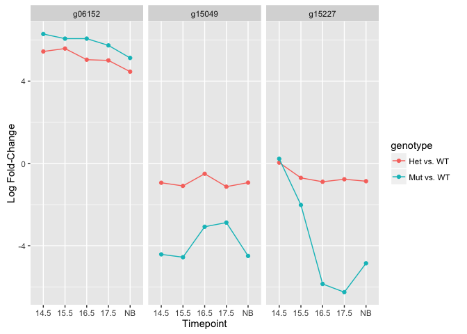

# Analysis of genotypes in Skin-Enhancer Knockout mice
Zane Goodwin  
December 25, 2016  
## Background
Enhancers are critical for increasing gene expression in a tissue-specific manner. My lab generated a mouse line where an enhancer required for epithelial development has been removed via genetic manipulation. As we weren't sure which genes would be affected by removing this enhancer, we sought to measure the expression of all genes in the the genomes of mice with the enhancer intact (wild type or "WT") and in the genmoes of mice with the enhancer partially intact (heterozygotes or "het") or completely removed (mutants or "mut"). By analyzing the diffrerences in gene expression between the "het" and "wt" and between the "mut" and "wt" mice, then we will gain a clearer picture of how this enhancer regulates gene expression in mice. Furthermore, we would like to see how gene epxression levels are changing between embryonic developmental time points (E14.5, E15.5, E16.5, E17.5 and newborn (NB)) when the skin barrier is established in mice.

**Disclaimer:** Since this is unpublished work, I am going to be vague about which enhancer was removed, how the enhancer was removed, and about which genes were affected when the enhancer was removed. As such, I have replaced the mouse gene names with ID numbers.  

## Methods
We measured gene expression in mice using a technique called RNA-Seq, where RNA molecules from mouse skin cells are sequenced using high-throughput sequencing technology. For each of the 5 time poins, We sequenced RNA from:

* 2 wild-type mice
* 2 heterozygous (het) mice
* 2 mutant (mut) mice

Overall, we sequenced rna from 30 mice, mapped the RNA sequences to the mouse reference genome using Bowtie and counted the number of reads matching to each gene using the `blah` from from R's `bioconductor` package. To control for biological variation and batch effects, we identified differentially-expressed genes using the `limma` pacakge. At the end of the day, we will end up with a list of differentially expressed genes for each of the time points.

## Setting the environment and getting the count data
First, I'm going to load the `limma` and `edgeR` packages, which contain tools necessary to perform the analysis. These packages contain the statistical methods that will normalize read counts in a way that makes it possible to identify differentially expressed genes. I'll also be using the stringR package for a bit of string manipulation.

```r
library(limma)
library(edgeR)
library(stringr)

# File locations
COUNT_FILE = "../data/all_counts.csv"
SAMPLE_KEY_FILE = "../data/sample_key_obs.csv"
DESIGN_MATRICES = "../design_matrices/"
RESULTS_DIR = "../results/"

# Read in the data
sampleKey = read.csv(SAMPLE_KEY_FILE, header=T)
counts = read.csv(COUNT_FILE, header=T, row.names=1)
```

Now, I will make a few DGE list objects for each mouse age in order to compare gene expression levels at each developmental time point.


```r
setup_dge = function(counts_table, search_string){
  counts = counts_table[,grep(search_string,colnames(counts))]
  dge = DGEList(counts = counts)
  dge = calcNormFactors(dge)
  
  # Get rid of all genes with less than 10 counts (counts per million < 2)
  keep = rowSums(cpm(dge)>2) >= 3
  dge = dge[keep, , keep.lib.sizes=FALSE]
   
  return(dge)
}

e14_5_dge = setup_dge(counts, "E14.5")
e15_5_dge = setup_dge(counts, "E15.5")
e16_5_dge = setup_dge(counts, "E16.5")
e17_5_dge = setup_dge(counts, "E17.5")
nb_dge = setup_dge(counts, "NB")
```


## Sample quality assessment

An important part of any RNA-seq experiment is to estimate the batch effects that might inadvertently cause differences in gene expression. One way to do this is to look at the MDS of RNA-seq data from each mouse. For this experiment, the best possible case is that all of the heterozyote, WT and mutant mice have similar variances in gene expression levels. If they do, then they will cluster together on the MDS plot. 

<!-- -->

The MDS analsyis seems to show that there are overall differences in gene expression between the f4 and f5 mice for the newborns (NB) and the mice at E16.5. This is a less-than-ideal scenario, and probably means that for the E14.5, E15.5 and E17.5 mice, any differences that we observe in gene expression have more to do with overall differences in gene expression between the f4 and f5 replicate mice than differences between the het, mut and wt mice.

Given this, we will want to down-weight low-quality samples, which can be done in the next section. 

## Library normalization
This part constructs the design matrices and performs the library normalization necessary to determine log-fold-change. Also, given that we observed some outlier samples in the MDS analysis, we will want to down-weight the outlier samples, in this case, X, Y and Z. 

```r
get_design_matrix = function(sample_list, search_string, reference){
  sample = sample_list[grep(search_string,sample_list$Age),]
  genotype = relevel(sample$Genotype, ref=reference)
  design = model.matrix(~genotype)
  return(design)
}

plot_mean_variance = function(voom_object, title){
  plot(voom_object$voom.xy, 
       main = paste(title,":Mean-variance trend"), 
       xlab = "log2( count size + 0.5 )", 
       ylab = "Sqrt( standard deviation )")
  lines(voom_object$voom.line$x, voom_object$voom.line$y, type = "l", col="red")
}

e14_5_dm = get_design_matrix(sampleKey, "E14.5", "wt")
e15_5_dm = get_design_matrix(sampleKey, "E15.5", "wt")
e16_5_dm = get_design_matrix(sampleKey, "E16.5", "wt")
e17_5_dm = get_design_matrix(sampleKey, "E17.5", "wt")
nb_dm = get_design_matrix(sampleKey, "NB", "wt")

# Normalize read counts
e14_5_norm = voom(e14_5_dge, e14_5_dm, plot=FALSE, save.plot = TRUE)
e15_5_norm = voom(e15_5_dge, e15_5_dm, plot=FALSE, save.plot = TRUE)
e16_5_norm = voom(e16_5_dge, e16_5_dm, plot=FALSE, save.plot = TRUE)
e17_5_norm = voom(e17_5_dge, e17_5_dm, plot=FALSE, save.plot = TRUE)
nb_norm = voom(nb_dge, nb_dm, plot=FALSE, save.plot = TRUE)

# Check the mean-variance trend to visualize the distribution of read counts
par(mfrow=c(2,3))
plot_mean_variance(e14_5_norm, "E14.5")
plot_mean_variance(e15_5_norm, "E15.5")
plot_mean_variance(e16_5_norm, "E16.5")
plot_mean_variance(e17_5_norm, "E17.5")
plot_mean_variance(nb_norm, "NB")
```

<!-- -->


```r
library(ggplot2)
plot_weights = function(voom_object, title){
  df = data.frame(samples = rownames(voom_object$targets), 
                  wts = voom_object$sample.weights)
  
  text_color = "black"
  p = ggplot(data=df, aes(x=samples, y=wts)) + 
      ggtitle(title) + 
      xlab("") + 
      ylab("Sample Weight") + 
      theme(axis.text.x = element_text(angle=45,hjust=1,vjust=1, colour=text_color),
            axis.text.y = element_text(colour=text_color)) +
      geom_bar(stat="identity") + 
      geom_hline(yintercept=1.0, colour = "red", linetype="dashed")
  return(p)
}

# Down-weight outlier samples 
e14_5_wts = voomWithQualityWeights(e14_5_dge, e14_5_dm, normalization = "none", plot=FALSE)
e15_5_wts = voomWithQualityWeights(e15_5_dge, e15_5_dm, normalization = "none", plot=FALSE)
e16_5_wts = voomWithQualityWeights(e16_5_dge, e16_5_dm, normalization = "none", plot=FALSE)
e17_5_wts = voomWithQualityWeights(e17_5_dge, e17_5_dm, normalization = "none", plot=FALSE)
nb_wts = voomWithQualityWeights(nb_dge, nb_dm, normalization = "none", plot=FALSE)

# Visualize weights
source("./multiplot.R")
multiplot(plot_weights(e14_5_wts, "E14.5"),
         plot_weights(e15_5_wts, "E15.5"),
         plot_weights(e16_5_wts, "E16.5"),
         plot_weights(e17_5_wts, "E17.5"),
         plot_weights(nb_wts, "NB"), cols=3)
```

```
## Loading required package: grid
```

<!-- -->

## Calling differentially-expressed genes
Fit linear model and perform an empirical Bayes test to model gene expression data. The purpose of this step is to fit a linear model to all the gene expression levels for each sample, then do an empirical bayes test to distingush whether or not each gene is differentially expressed.

```r
# Fit bayes models to the weighted samples
e14_5_vfit = lmFit(e14_5_wts) %>% eBayes(.)
e15_5_vfit = lmFit(e15_5_wts) %>% eBayes(.)
e16_5_vfit = lmFit(e16_5_wts) %>% eBayes(.)
e17_5_vfit = lmFit(e17_5_wts) %>% eBayes(.)
nb_vfit = lmFit(nb_wts) %>% eBayes(.)

diffexp_14_5 = topTable(e14_5_vfit, adjust="BH", number = Inf, sort.by = "F")
diffexp_15_5 = topTable(e15_5_vfit, adjust="BH", number = Inf, sort.by = "F")
diffexp_16_5 = topTable(e16_5_vfit, adjust="BH", number = Inf, sort.by = "F")
diffexp_17_5 = topTable(e17_5_vfit, adjust="BH", number = Inf, sort.by = "F")
diffexp_nb = topTable(nb_vfit, adjust="BH", number = Inf, sort.by = "F")
```

## Visualization of differentially expressed genes

Let's take a look at the top 10 differentially expressed genes in each group:

```r
head(diffexp_14_5, n=10)
```

```
##        genotypehet genotypemut    AveExpr         F      P.Value
## g06152   5.4404340   6.2899863  4.0725912 310.71667 2.701590e-08
## g15049  -0.9387996  -4.4194892  3.8473127 225.22376 9.569044e-08
## g23871  -0.8919134  -0.2954030  6.5399264  39.06979 7.552686e-05
## g23325   1.7286976   0.3852259  2.8016818  25.87956 3.249740e-04
## g24477  -1.2956166  -0.4736940  4.8129454  25.56171 3.391456e-04
## g17090  -1.2540048  -0.3692444  4.7925010  19.89144 7.934668e-04
## g08862  -1.3874224  -0.4132130  4.2472790  17.53658 1.200631e-03
## g18249  -2.3227011  -0.2900504  7.2903572  16.89413 1.354909e-03
## g15584  -0.4946208  -0.1408143 10.0571715  16.78950 1.382334e-03
## g24384   2.5924406   0.9994861  0.8283235  16.53567 1.451808e-03
##           adj.P.Val
## g06152 0.0004150723
## g15049 0.0007350940
## g23871 0.3867982359
## g23325 0.9999817013
## g24477 0.9999817013
## g17090 0.9999817013
## g08862 0.9999817013
## g18249 0.9999817013
## g15584 0.9999817013
## g24384 0.9999817013
```

```r
head(diffexp_15_5, n=10)
```

```
##        genotypehet genotypemut  AveExpr         F      P.Value
## g15049 -1.09201676  -4.5567591 4.212476 226.80295 5.381073e-08
## g06152  5.58368539   6.0653350 4.352118  68.91031 6.524125e-06
## g15227 -0.70143814  -2.0168852 3.360533  29.84369 1.582539e-04
## g22149  0.51710553   1.3971315 6.111686  21.83003 4.851067e-04
## g22389  0.17898045  -1.3613950 1.320645  15.00308 1.727331e-03
## g00299  0.03804754  -0.4450363 7.913452  14.53675 1.914086e-03
## g02917  0.59997447   2.0552826 7.585050  13.84807 2.238111e-03
## g15008  0.34344249   0.6227326 4.314220  13.65669 2.340009e-03
## g12157  0.59424948   1.5546804 1.131011  11.67930 3.820432e-03
## g14950  0.75851327   1.2709116 1.569100  11.46531 4.043226e-03
##           adj.P.Val
## g15049 0.0007861209
## g06152 0.0476554693
## g15227 0.7706436787
## g22149 0.9999841234
## g22389 0.9999841234
## g00299 0.9999841234
## g02917 0.9999841234
## g15008 0.9999841234
## g12157 0.9999841234
## g14950 0.9999841234
```

```r
head(diffexp_16_5, n=10)
```

```
##        genotypehet genotypemut  AveExpr         F      P.Value   adj.P.Val
## g06152   5.0411233   6.0655203 4.232225 301.04231 1.114360e-07 0.001621616
## g15227  -0.8911125  -5.8577237 6.675333  97.41137 5.988629e-06 0.043573267
## g15475  -0.6562122  -1.2604911 3.816127  44.89520 8.460002e-05 0.410366481
## g15352  -0.4193083  -0.6897110 6.595889  38.19155 1.447183e-04 0.526485111
## g15647   0.1655916   0.7018491 4.434263  27.28033 4.312140e-04 0.999862233
## g08846   0.9962578   0.1904536 3.476773  19.87456 1.159744e-03 0.999862233
## g15666   0.1851144   0.5562974 5.441799  15.49545 2.442648e-03 0.999862233
## g15614   0.7232219   1.3923489 1.203521  14.60829 2.899983e-03 0.999862233
## g13067   0.6477807   0.1357050 3.450314  13.73338 3.463734e-03 0.999862233
## g15360   0.1042889   0.3428751 8.705701  13.42049 3.698994e-03 0.999862233
```

```r
head(diffexp_17_5, n=10)
```

```
##        genotypehet genotypemut  AveExpr         F      P.Value
## g15227 -0.76848637 -6.25709057 6.490393 586.56824 4.197821e-09
## g06152  5.00773956  5.73703438 4.215381 281.12169 6.826935e-08
## g04070  0.50697579 -0.05001838 7.369222  25.27140 4.243077e-04
## g13752  0.44491420 -0.16327226 5.402142  22.71036 6.037419e-04
## g03414 -0.27499751  0.41117147 6.141762  22.01697 6.681431e-04
## g19251  0.05348865  0.54941522 5.419935  20.99626 7.795868e-04
## g12687  0.27768248 -0.16351251 7.393078  17.16651 1.480650e-03
## g15239  0.39606775 -0.07342791 7.081951  16.96082 1.537525e-03
## g04173 -0.38058271  0.33609514 4.979298  16.80609 1.582133e-03
## g20743  0.47516505  0.15861009 6.374456  16.50127 1.674895e-03
##           adj.P.Val
## g15227 0.0000614561
## g06152 0.0004997316
## g04070 0.9996980112
## g13752 0.9996980112
## g03414 0.9996980112
## g19251 0.9996980112
## g12687 0.9996980112
## g15239 0.9996980112
## g04173 0.9996980112
## g20743 0.9996980112
```

```r
head(diffexp_nb, n=10)
```

```
##        genotypehet genotypemut  AveExpr         F      P.Value  adj.P.Val
## g06152  4.45969240   5.1265719 2.256903 120.05579 7.150150e-06 0.07461762
## g15049 -0.93308058  -4.4966935 3.626594 101.16168 1.229995e-05 0.07461762
## g04064  2.33195225   0.6162181 2.630995  24.67303 9.073355e-04 0.99992082
## g14002 -0.18344284   0.8406997 4.965636  23.55745 1.036334e-03 0.99992082
## g15227 -0.86381001  -4.8522557 7.887913  22.06329 1.249406e-03 0.99992082
## g15456  0.33703851   0.8914618 7.435695  21.28662 1.383017e-03 0.99992082
## g04056 -0.05077572   0.7132846 6.161889  20.16040 1.611960e-03 0.99992082
## g14975 -0.43322600  -1.1738242 4.679897  16.73137 2.701400e-03 0.99992082
## g16772 -0.10461412  -1.1102137 2.611668  14.83980 3.735790e-03 0.99992082
## g24736 -0.22313201   1.1105290 2.084139  14.40875 4.041318e-03 0.99992082
```

P-values were corrected for multiple tests using the Benjamnini-Hochberg method. I will consider only genes that are significant at the 5% level for each of the 5 time points. The genes that satisfy this condition are g06152, g15049 and g15227. Let's take a look at how the expression levels of these genes change over time. Though these genes were not significant at the 5% level for the newborn (NB) time point, 


```r
# Shift rownames to new column
diffexp_14_5$gene = rownames(diffexp_14_5)
diffexp_15_5$gene = rownames(diffexp_15_5)
diffexp_16_5$gene = rownames(diffexp_16_5)
diffexp_17_5$gene = rownames(diffexp_17_5)
diffexp_nb$gene = rownames(diffexp_nb)

# Add time data to columns
diffexp_14_5$timepoint = rep(14.5,nrow(diffexp_14_5))
diffexp_15_5$timepoint = rep(15.5,nrow(diffexp_15_5))
diffexp_16_5$timepoint = rep(16.5,nrow(diffexp_16_5))
diffexp_17_5$timepoint = rep(17.5,nrow(diffexp_17_5))
diffexp_nb$timepoint = rep("NB",nrow(diffexp_nb))


# Pull out the expression levels for the genes of interest for each time point.
goi = data.frame()
genes = c("g06152", "g15049", "g15227")
goi = rbind(goi,
      diffexp_14_5[which(diffexp_14_5$gene %in% genes),],
      diffexp_15_5[which(diffexp_15_5$gene %in% genes),],
      diffexp_16_5[which(diffexp_16_5$gene %in% genes),],
      diffexp_17_5[which(diffexp_17_5$gene %in% genes),],
      diffexp_nb[which(diffexp_nb$gene %in% genes),])

# Select columns
goi_select = goi[,c(1,2,7,8)]

# Melt the data frame
library(reshape)
mdf = melt(goi_select, id.vars=3:4, measure.vars=1:2, variable_name = "genotype")
mdf$genotype = gsub("genotype", "", mdf$genotype)
mdf$genotype = gsub("het", "Het vs. WT", mdf$genotype)
mdf$genotype = gsub("mut", "Mut vs. WT", mdf$genotype)

# Plot the fold change in expression versus time
ggplot(data=mdf, aes(x=timepoint, y = value, colour=genotype)) + 
      geom_point() + 
      geom_line(aes(group=genotype)) + 
      facet_grid(~ gene) + 
      xlab("Timepoint") + 
      ylab("Log Fold-Change")
```

<!-- -->
Here, you can see that mice with a heterozygous copy of the enhancer and with the mutant enhancer have different expression levels. What's more is that for g15049 and g15227, the mutant enhancer mice show a dose-dependent decrease in expression that occurs at all time points. A notable exception is g06152, where the mutant shows a higher increase in gene expression compared to the wild type and to the heterozygote. This suggests that this gene is up-regulated in response to enhancer loss and could be a genetic compensatory effect. 
